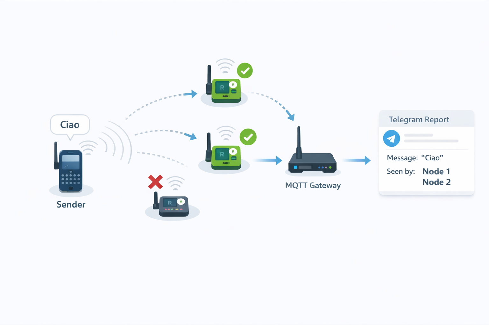

# Mesh Observer

`mesh-observer` helps you observe how a Meshtastic message propagates through the mesh. Instead of manually watching raw traffic, it collects multiple sightings of the same message and turns them into a single propagation report.

It does this by subscribing to Meshtastic MQTT JSON topics, correlating duplicate sightings across MQTT-connected nodes, and publishing live updates to Telegram.

This only works for nodes that are explicitly configured to participate in the MQTT exchange. If a node is not set up to publish Meshtastic JSON packets to the broker, `mesh-observer` cannot observe its traffic.



## How It Works

- Meshtastic nodes publish JSON packets to MQTT topics such as `msh/+/2/json/#`
- `mesh-observer` subscribes to those topics and parses both the MQTT topic structure and the JSON envelope
- When the same radio packet is seen by multiple nodes, it merges those sightings into one aggregate event
- Redis is used to keep short-lived aggregation state while new sightings for the same packet continue to arrive
- The resulting propagation report tracks which nodes saw the packet and, when available, their coordinates and hop count
- Telegram is used as the output channel by updating the same message as propagation evolves; if Telegram is not configured, reports are written to local logs

## Why This Exists

Meshtastic already provides useful native tools such as node databases, telemetry, neighbor information, and traceroute-style diagnostics. `mesh-observer` on the other hand is message-centric, it allows to understand how a message propagate across a well known list of nodes.

## Requirements

- Go 1.23+ recommended
- `task` for the bundled tasks
- Docker only if you want to build/push an image or run the helper Mosquitto/Redis containers
- An MQTT broker and Redis instance
- Meshtastic nodes configured to publish their JSON traffic to that broker; nodes that are not configured for MQTT participation will not appear in the reports

## Quick Start

1. Create your local configuration starting from the example: `cp .env.example .env`

2. Start locally for a basic test with: `task up`

3. Configure the Meshtastic node that should participate in observation:
    - Enable MQTT on the node in the Meshtastic app or Web UI
    - Point it to the same broker configured in `MQTT_BROKER`
    - Use the matching port and TLS setting for that broker
    - If your broker requires authentication, configure the same username and password on the node
    - Enable upstream on the Meshtastic channels you want to monitor
    - Save/apply the configuration and let the node reconnect

4. Send a message to the channel where the upstream has been enabled

5. Check the configured Telegram chat: the propagation report for that message should appear there. If Telegram is not configured, the same information is written to local logs instead.


## Prepare The Docker Image For Deploy

Set your target image in `.env`:

```bash
IMAGE_REPOSITORY=ghcr.io/your-user/mesh-observer
IMAGE_TAG=latest
```

Then run:

```bash
task build-image
task push-image
```

Once the image is published, you can deploy it however you prefer in your target environment. As one example, the companion repository `mesh-observer-k8s` can be used to deploy the stack on Kubernetes using a prebuilt image.

## Configuration

- `IMAGE_REPOSITORY`: container image repository used by `task build-image` and `task push-image`
- `IMAGE_TAG`: container image tag used for build and push
- `MQTT_BROKER`: broker URL, for example `tcp://localhost:1883` or `ssl://broker.example.com:8883`
- `MQTT_TOPIC_FILTER`: topic subscription, default `msh/+/2/json/#`
- `MQTT_QOS`: MQTT QoS, default `1`
- `REDIS_ADDR`: Redis address, default `localhost:6379`
- `REDIS_PASSWORD`: optional Redis password
- `REDIS_DB`: Redis database number, default `0`
- `REDIS_EVENT_TTL_SECONDS`: TTL for temporary aggregated message state, default `300`
- `REDIS_POSITION_TTL_SECONDS`: TTL for cached node position data, default `86400`
- `START_MQTT_BROKER_ON_PORT`: optional host port used by `task broker-up` to expose the local Mosquitto container; leave it empty to skip local MQTT startup
- `START_REDIS_ON_PORT`: optional host port used by `task redis-up` to expose the local Redis container; leave it empty to skip local Redis startup
- `MAP_IMAGE_ENABLED`: enable static map upload after final aggregation
- `MAP_IMAGE_WIDTH`: generated map image width in pixels
- `MAP_IMAGE_HEIGHT`: generated map image height in pixels
- `MAP_PROVIDER_URL`: static map provider base URL
- `AGGREGATION_WINDOW_SECONDS`: time window used to collect multiple sightings of the same message
- `CLEANUP_INTERVAL_SECONDS`: cleanup loop interval for expired in-memory and Redis-backed state
- `MESSAGE_PREVIEW_LEN`: maximum preview length shown for the message body
- `MAX_OBSERVATIONS_PER_MESSAGE`: cap on stored observations for a single message
- `TELEGRAM_BOT_TOKEN`: Telegram bot token; leave empty to disable Telegram delivery
- `TELEGRAM_CHAT_ID`: Telegram target chat ID; leave empty to disable Telegram delivery

`START_*` variables are only used by the bundled tasks that launch local helper services. The application itself reads the runtime variables such as `MQTT_BROKER` and `REDIS_ADDR`. If a `START_*` variable is empty, the corresponding local service is not started.

## Task Reference

```bash
task help
```

- `task help`: list available tasks
- `task build-image`: build the Docker image defined by `IMAGE_REPOSITORY` and `IMAGE_TAG`
- `task push-image`: push the Docker image to the configured registry
- `task observer`: run the app against the configured runtime variables
- `task broker-up`: start a local Mosquitto container if `START_MQTT_BROKER_ON_PORT` is set
- `task broker-down`: stop and remove the local Mosquitto container
- `task redis-up`: start a local Redis container if `START_REDIS_ON_PORT` is set
- `task redis-down`: stop and remove the local Redis container
- `task up`: start any enabled local helper services and run the observer
- `task down`: stop local helper containers

## Notes

- The current implementation is focused on Meshtastic JSON topics.
- Node names in Telegram are shown when they have previously been seen as message senders and cached in Redis.
- If MQTT publish works locally but not in another deployment, the first thing to verify is whether messages are actually reaching the broker.
